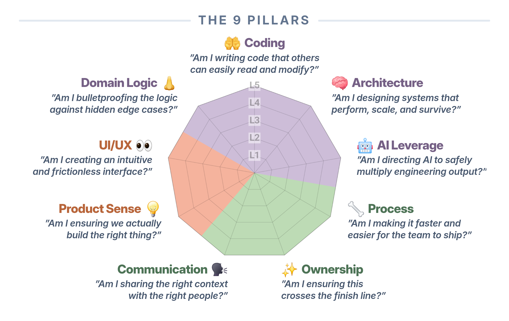

# 9-Pillar Engineer Growth Framework

> A spider chart to measure software engineering mastery, identify core interests, and guide career paths.

By **[Jasper Loo Zhu Hang](https://www.linkedin.com/in/zhuhangloo/)**

[](https://github.com/zhuhang-jasper/egf/releases/latest)
[](https://zhuhang-jasper.github.io/egf/?tab=theory)
[](LICENSE)
[](CONTENT-LICENSE.md)




Live app: **https://zhuhang-jasper.github.io/egf/**

Runs entirely in the browser, no account needed. JSON profile import/export available. Installable to your home screen as a PWA.

## The framework

Nine pillars, each mapped to a part of the body, grouped into three clusters:

- **Technical** — 🤲 Coding (Hands), 👃 Domain Logic (Nose), 🧠 Architecture (Brain), 🤖 AI Leverage (Machine)
- **Product** — 👀 UI/UX (Eyes), 💡 Product Sense (Gut)
- **Operational** — 🦴 Process (Spine), 🗣️ Communication (Voice), ✨ Ownership (Soul)

Every pillar carries a signature question and five proficiency levels, making a 45-point competency matrix. Read the full theory in the app's Theory tab.

## Using this framework

You are free to share and adapt it for non-commercial purposes, as long as you credit it. Copy this:

```
9-Pillar Engineer Growth Framework by Jasper Loo Zhu Hang, licensed under CC BY-NC 4.0.
https://zhuhang-jasper.github.io/egf/
```

If you adapted it rather than reproduced it as is, say so. For commercial use, including paid training, consulting, workshops, or commercial products, get in touch: [zhuhang.jasper@gmail.com](mailto:zhuhang.jasper@gmail.com)

## Licensing

This repository is dual-licensed. The source code is released under the MIT License, see [LICENSE](LICENSE).

The 9-Pillar Engineer Growth Framework content itself, its pillar definitions, competency matrix, level descriptions, career tracks, and written theory, is © 2026 Jasper Loo Zhu Hang and licensed under [CC BY-NC 4.0](https://creativecommons.org/licenses/by-nc/4.0/). See [CONTENT-LICENSE.md](CONTENT-LICENSE.md) for the full terms.
